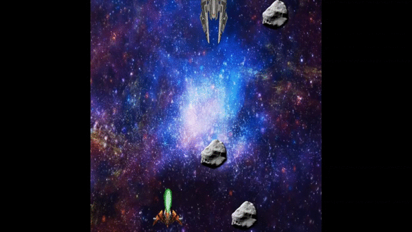

# Asteroid 

## Juego realizado con la biblioteca Wollok Game

### Resumen:

Este juego está inspirado en Asteroids de 1979. En esta aventura estamos al mando de una nave que se mueve en todas direcciones y debe enfrentarse a ordas de alienígenas invasores, que se reunen en la parte superior de la pantalla. Así mismo, nuestra nave también debe enfrentarse a peligrosos asteroides que aparecen de todos lados y en todos los tamaños.

El objetivo de este juego es mover la nave espacial que esta bajo nuestro comando, para escapar de los ataques enemigos, y al mismo tiempo disparar para destruir cada una de las naves enemigas y asteroides.

Aunque posee una dinámica bastante sencilla, el juego en el que está basado el nuestro, acaparó la atención de una gran cantidad de jugadores alrededor de todo el mundo. Con esto podemos reforzar la idea de que, un juego sencillo puede resultar muy interesante.

### Instrucciones:

El jugador utilizará las flechas de movimiento (arriba), (abajo), (izquierda) y (derecha) para moverse y la barra espaciadora para disparar.

### Autores:
- Lucas Natuche
- Nicolás Fernández
- Micaela Pavarín
- Esteban Ruiz
- Tatiana Alvarez

Docente/Curso/Institución:
- Lucas Spigariol
- Juan Bono
- Miguel Cames

Paradigmas de Programación

UTN Facultad Regional Delta

Versión de wollok: 1.9.2

Fecha: 30/06/2020
